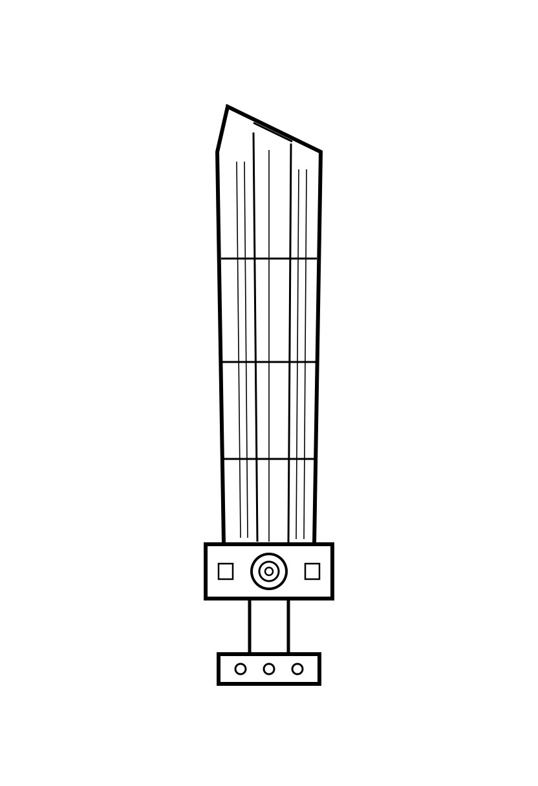
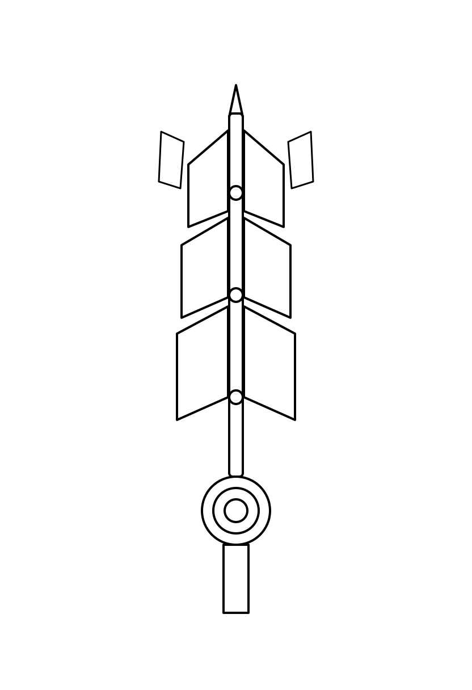

# MIKAGE ZENITH BLADE — ACCEPTED-REFERENCE CONTACT SHEET — V1

Generated by: Claude Cowork (Mikage repo operator — Character Cast Lane)
Generated on: 2026-06-02
Status: **REFERENCE INDEX — REVIEW-LEVEL ONLY**
Scope: read-only catalogue of the Zenith Blade references accepted at the 2026-06-02 render-scoring pass.
Lock state inherited: **ZENITH_BLADE_STRUCTURE_CANON = 🔒 LOCKED 2026-06-02** (structural/2D only). Renders/3D remain review-candidate.

> This is an INDEX, not a promotion. Nothing here is canon-locked, asset-locked, production-ready, film-ready, or
> public-ready by this file. Items already off-repo (on the terminated RunPod / in the canon `\10` tree outside the
> sandbox) are marked **CHUA_XAC_NHAN** for on-disk presence — they are recorded from the handoff scoring, not
> re-verified byte-for-byte here. Images that ARE in-repo are embedded below by relative path.

---

## 1. SUMMARY TABLE

| Slot | Phase | Disposition (2026-06-02 scoring) | Primary artifact | On-disk in repo? |
|---|---|---|---|---|
| A | P1 Compact-Idle / Imperial Clean | **PRIMARY DESIGN REFERENCE** ("Silent Monolith" concept sketch) | `tools/zenith_blade_render/inputs/ZBLADE_CTRL_P1.png` | YES |
| B | P1 supporting | SUPPORTING RENDER CANDIDATE (pod monolith 00004–00006) | pod output `mv`/canon tree | NO — CHUA_XAC_NHAN |
| C | P2 Brutal Activation / Fallen-Exile | **HOLD** (best grey-bg seed only) | pod output | NO — CHUA_XAC_NHAN |
| D | P3 Overdrive / Execution — seed 00001 | **INCLUDE_AS_PHASE4_REFERENCE** | pod output | NO — CHUA_XAC_NHAN |
| E | P3 Overdrive / Execution — seed 00002 | **INCLUDE_AS_PHASE4_REFERENCE** | pod output | NO — CHUA_XAC_NHAN |
| F | P1 earlier full render | **REJECT_REWORK** ("popsicle/ice-cream bar" — too plain) | pod output | NO — CHUA_XAC_NHAN |
| G | Structure blueprint — REST/P1 | DETERMINISTIC VECTOR (structure-canon reference) | `design/zenith_blade_clean_v1/MIKAGE_ZENITH_BLADE_REST_CLEAN_V1.svg` | YES |
| H | Structure blueprint — COMBAT/P2-P3 | DETERMINISTIC VECTOR (structure-canon reference) | `design/zenith_blade_clean_v1/MIKAGE_ZENITH_BLADE_COMBAT_ACTIVE_CLEAN_V1.svg` | YES |
| I | Shell-open control line-art | CONTROLNET SOURCE (P2/P3 open state) | `tools/zenith_blade_render/inputs/ZBLADE_CTRL_OPEN.png` | YES |

In-repo embeddable artifacts: A, G, H, I. Off-repo (pod / canon \10): B, C, D, E, F.

---

## 2. IN-REPO PLATES (embedded by relative path)

### Plate A — P1 "Silent Monolith" concept sketch (PRIMARY P1 reference)
Operator-supplied concept art (line-art with callouts), accepted as the primary P1 art-direction reference and
recommended P1 ControlNet source. Front + side monolith views; callouts: Drive Hub (hydraulic core / concentric
joint), Titanium base (magnetic lock / flux-pinning mount / Ti mirror baseplate). Reads as a tall sealed B4C
monolith — the closed Compact-Idle block, NOT the rejected "popsicle" full render.



> Note (from handoff): a P1 **rework** is queued — `ZBLADE_CTRL_P1` to be redrawn to a SHEATHED GREATSWORD
> silhouette (long blade + guard + wrapped grip), prompt → "sheathed greatsword encased in white B4C", NEG +=
> popsicle/ice-cream/candy/toy/cute, ControlNet strength 0.7. Re-run is operator-side; not done here.

### Plate I — Shell-open control line-art (P2/P3 ControlNet source)
Deterministic line-art (built via cairosvg, NOT an AI render): central pointed blade with B4C shell panels split
open + concentric circular drive hub at base + grip. Source for the COMBAT-ACTIVE / P2–P3 open state.



### Plate G — REST / P1 clean blueprint (SVG)
`design/zenith_blade_clean_v1/MIKAGE_ZENITH_BLADE_REST_CLEAN_V1.svg` — P1 Compact-Idle = closed B4C brutal block.
Deterministic vector; usable as structure-canon reference + ControlNet source.

### Plate H — COMBAT / P2–P3 clean blueprint (SVG)
`design/zenith_blade_clean_v1/MIKAGE_ZENITH_BLADE_COMBAT_ACTIVE_CLEAN_V1.svg` — P2/P3 = B4C shell split → Ti frame
+ Ferro-calcium core. Deterministic vector.

(SVGs are linked, not inlined, so this index stays render-free.)

---

## 3. OFF-REPO PLATES (CHUA_XAC_NHAN — record-only)

These were scored from the 2026-06-02 RunPod pass; the pod is **TERMINATED** and the files are not in the sandbox.
Disposition is carried verbatim from the handoff pointer. To make these embeddable, operator must download them
into the repo (suggested: `design/zenith_blade_clean_v1/accepted_refs/`) — a separate operator step.

| Plate | Phase / seed | Disposition | What it shows (per handoff scoring) |
|---|---|---|---|
| B | P1 monolith 00004–00006 | SUPPORTING | Pod renders supporting the Silent Monolith P1 read. |
| C | P2 | HOLD | Transition OK; marble/scene background distracting — keep cleanest grey-bg seed only. |
| D | P3 seed 00001 | INCLUDE_AS_PHASE4_REFERENCE | Brutal Ti frame + red #E60000 core + hilt glow, on-spec. |
| E | P3 seed 00002 | INCLUDE_AS_PHASE4_REFERENCE | Same on-spec P3 read, alt seed. |
| F | P1 early full render | REJECT_DO_NOT_USE as P1 final | "Popsicle / ice-cream bar" — too plain/cute, no blade mass. Negative reference. |

Also recorded but NOT a silhouette source: the ornate MJ-style blueprint candidate = **DRIFT** vs locked canon
(thin elegant blade / fantasy ornament); usable ONLY as internal-mechanism reference (circular drive + telescoping)
for P2/P3, never as the main silhouette. Adopting it as the look would require explicit operator UNLOCK of
STRUCTURE_CANON. Not adopted.

---

## 4. CANON / GOVERNANCE GUARDRAILS (inherited, not changed here)

- Structure canon LOCKED 2026-06-02 (synced 3-phase + B4C-outer/Ti-inner + Compact-Idle closed block). 2D/structural
  scope only.
- All renders above = REVIEW CANDIDATES. None promoted to canon / asset-lock / production-ready by this index.
- Forbidden silhouette: thin elegant/fantasy blade, ornament-as-silhouette, "popsicle" plain block.
- No film / video / short / shotlist is created or implied by this catalogue.

---

## 5. RECOMMENDED NEXT (operator-side, optional)

```text
- (optional) operator downloads accepted off-repo plates B/C/D/E into design/zenith_blade_clean_v1/accepted_refs/
  so this contact sheet can embed them; then Cowork can refresh §3 into embedded plates.
- (optional) operator runs the queued P1 sheathed-greatsword rework re-render; Cowork scores it.
- NO canon/asset-lock; NO render by Cowork.
```

---

## 6. REPORT BLOCK

```text
FILES_READ      = handoff pointer (blade scoring lines) ; ZBLADE_CTRL_P1.png ; ZBLADE_CTRL_OPEN.png ;
                  design/zenith_blade_clean_v1/ listing ; SESSION_RESUME_NOTE_20260602.md
FILES_CHANGED   = 1 CREATED: docs/handoff/MIKAGE_ZENITH_BLADE_ACCEPTED_REFERENCE_CONTACT_SHEET_V1.md
VERIFY_STATUS   = in-repo plates (A,G,H,I) verified present + viewed; off-repo plates (B-F) CHUA_XAC_NHAN (pod terminated)
ISSUES_FOUND    = accepted P2/P3/monolith renders not in repo → cannot embed until operator downloads
NEXT_SAFE_TASK  = OPERATOR optional download of off-repo plates / queued P1 rework re-render
BLOCKERS        = pod terminated (off-repo refs unreachable) ; shell sandbox down ; git push operator-side
```

---

*End of contact sheet. Reference index only. No canon-lock. No asset-lock. No render by Cowork.*
