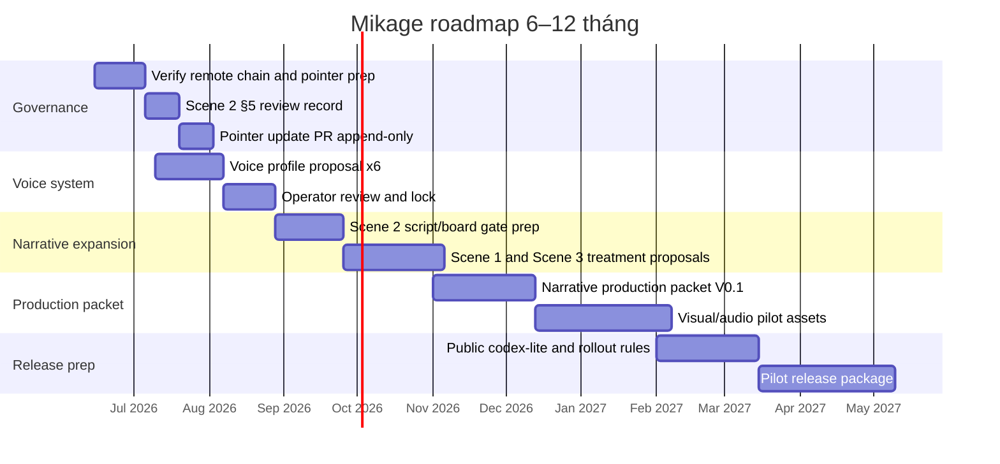

# Nghiên cứu sâu về xây dựng và phát triển dự án Mikage

## Executive summary

Mikage hiện đã có một “xương sống narrative” rõ ràng hơn rất nhiều so với đa số dự án IP đi theo hướng AI-first: chuỗi tài liệu đã hình thành được logic **GAP_PROPOSAL → CORE_LOCK → FULL_7_STEP_PLAN → TEST_SCENE_EXPANSION cho Scene 2**, thay vì nhảy từ visual sang render hoặc public rollout. Ở mức nội dung, phần mạnh nhất đã có đủ: **core question C**, **wound / false belief / want / need / cost**, **3 mirror**, **5 luật thế giới**, **one-page bible**, và **một core test scene đã được treatment hóa**. Điều này bám khá sát logic storytelling và production staging mà Pixar/Khan Academy nhấn mạnh — học làm phim như một quy trình có cấu trúc — và cũng gần với logic character-centered structure mà Beemgee tóm tắt từ John Truby. fileciteturn0file0 citeturn20view0turn17view0

Tuy vậy, báo cáo này **không thể xác nhận “toàn bộ repo” theo đúng nghĩa connector-verified**. Tôi đã ưu tiên hướng connector-first như bạn yêu cầu, nhưng trong phiên này GitHub connector **không surfaced thành tool queryable** để đọc trực tiếp tree, blob, history, hay PR của repo `nookun987-pixel/KAGAMI-MZ`. Vì vậy, phần audit repo dưới đây là **audit tối đa những gì có thể xác minh trong phiên**: gồm một file connector-backed được surface trong session (`MIKAGE_NARRATIVE_CORE_GAP_PROPOSAL_V0_1.md`) và ba file repo-derived mà bạn đã dán nguyên văn trong cuộc trò chuyện (`MIKAGE_NARRATIVE_CORE_LOCK_V0_1.md`, `MIKAGE_FULL_7_STEP_CHARACTER_WORLD_PLAN_V0_1.md`, `MIKAGE_SCENE_2_FORCED_CHOICE_TREATMENT_V0_1.md`). Mọi mục chưa có bằng chứng trực tiếp đều được gắn nhãn **CHƯA XÁC NHẬN**. fileciteturn0file0

Kết luận ngắn: **Mikage không còn thiếu “lõi narrative” như giai đoạn audit ban đầu nữa; hiện thiếu chủ yếu ở tầng thực thi và governance**. Blocker lớn nhất là **voice/dialogue profiles ×6 vẫn MISSING**, vì treatment Scene 2 hiện cấm dialogue và không thể đi lên script/board/dialogue-bearing assets khi chưa có giọng nói, nhịp câu, độ lạnh/nóng, và sample-line governance cho từng entity. High-priority tiếp theo là **Scene 2 Treatment vẫn là draft ở tầng quản trị nếu §5 chưa được operator ghi chốt trong file đang sống trên remote**, và **pointer registration chưa được append vào `00_LATEST_CODEX_HANDOFF.md`**, khiến discoverability và “single source of truth” chưa hoàn chỉnh. Còn các gap như **Dr. Aris profile**, **WEAPON_DRIFT_001**, **LORA public framing**, **Clean Digital Gold hex**, và **height lock** là thật, nhưng không cùng mức chặn với voice system. Những nhận định này khớp với cách pipeline narrative/game hiện đại dùng stage-based flow, structured intermediates, human review, và quality gates để giảm drift. fileciteturn0file0 citeturn11academia2turn12academia7turn12academia8

Hướng đi phù hợp trong 6–12 tháng là: **ổn định governance trước, mở voice layer sau, rồi mới cho phép scene/script/board/public progression**. Nghĩa là không nên “đi lên” theo hướng thêm lore mới; nên đi lên theo hướng **khóa giọng nói, khóa decision table, khóa pointer, rồi mới nới gate cho expansion**. Điều này cũng khớp với GitHub/Git best practice: thay đổi nên đi qua proposal/review/merge rõ ràng, với draft dành cho work-in-progress và branch/PR dành cho những thay đổi chưa sẵn sàng nhập thẳng vào main. citeturn14view0turn16view0

## Phạm vi chứng cứ và giả định

Báo cáo này dùng một chân bằng chứng nội bộ và một chân bằng chứng ngành.

Về nội bộ, bằng chứng có độ tin cậy cao nhất là `MIKAGE_NARRATIVE_CORE_GAP_PROPOSAL_V0_1.md`, vốn được surfaced qua file channel trong session, và cho thấy rõ: file này là **PROPOSAL_ONLY**, chỉ điền **Step 1 + Step 3 + Step 7**, kéo dữ kiện từ `MIKAGE_ZENITH_CANON_V2.md`, `MIKAGE_WORLD_CORE_READABLE.md`, `character_workflow/MIKAGE_CHARACTER_PRODUCTION_BIBLE_V0_1.md`, nhiều file `docs/handoff/*`, và `docs/canon_proposals/MIKAGE_V2_5_DRAFT_PROPOSAL_PACKAGE.md`; đồng thời nó cũng ghi nhận operator sign-off sau đó: **Core Question C được approve**, **wound layer được approve**, **LOCK_Q1 unlock bị reject**, và **Scene 2 được approve như core test scene**. Đáng chú ý là một bản sớm hơn của cùng file vẫn còn toàn bộ hàng `PENDING`, nên repo đang vận hành đúng kiểu **per-clause review**, không phải “tự promote canon”. fileciteturn0file1 fileciteturn0file0

Về ngoại tham chiếu, tôi ưu tiên nguồn chính thống/primary khi có thể: **Pixar official** cho “Pixar in a Box”; **GitHub Docs** cho pull request, draft PR, review và merge flow; **git-scm** cho `git add`, `git show`, `git status`, `git push`; và dùng **Beemgee/Truby**, một số tài liệu nghiên cứu narrative/game pipeline, cùng tường thuật GDC chất lượng cao làm lớp đối chiếu quy trình. Pixar mô tả “Pixar in a Box” như một chuỗi tutorial cho thấy toán, khoa học và nghệ thuật tham gia trực tiếp vào workflow làm phim của Pixar — tức tư duy **pipeline-first**, không phải **vibe-first**. GitHub Docs mô tả PR như cơ chế trung tâm để đề xuất, review và merge thay đổi; đồng thời **draft pull request** là trạng thái phù hợp cho work-in-progress chưa sẵn sàng review/merge. Beemgee tóm tắt từ John Truby rằng một tuyến nhân vật mạnh thường phải khóa được **weakness/need, desire, opponent, plan, battle, self-revelation, new equilibrium**. citeturn20view0turn14view0turn16view0turn17view0

Các giả định chưa xác nhận, và cần được hiểu đúng khi đọc báo cáo này, gồm những điểm sau. Thứ nhất, tôi **chưa xác nhận được quyền truy cập full tree / blob / commit history / PR history** của repo `nookun987-pixel/KAGAMI-MZ` qua connector GitHub trong phiên này. Thứ hai, tôi **chưa xác nhận trực tiếp** nội dung của `MIKAGE_ZENITH_CANON_V2.md`, `MIKAGE_WORLD_CORE_READABLE.md`, `MIKAGE_CHARACTER_PRODUCTION_BIBLE_V0_1.md`, `MIKAGE_V2_5_DRAFT_PROPOSAL_PACKAGE.md`, hay toàn bộ nhóm `docs/handoff/*`; tôi chỉ xác nhận được rằng các file này được những tài liệu đã thấy dùng làm upstream source. Thứ ba, các commit hash và push status mà bạn nêu như `25ff455`, `23d6d06`, `a314aea` hiện phải được xem là **operator-reported, not connector-verified**. Thứ tư, line number cho `CORE_LOCK`, `FULL_PLAN`, và `SCENE_2_TREATMENT` trong báo cáo này là **line map dựng lại từ chính nội dung file bạn đã dán vào cuộc trò chuyện**, không phải line map đọc trực tiếp từ raw blob trên GitHub. Những giả định này là điểm quan trọng nhất để tránh kết luận quá tay.

## Audit repo và các artifact khóa

### Kết luận audit ở mức repo

Ở mức tối thiểu có thể xác minh, repo của Mikage đang có một chuỗi tài liệu narrative khá chặt. Dấu hiệu quan trọng nhất là bản `GAP_PROPOSAL` không chỉ đề xuất, mà còn ghi rõ **source boundaries**, **canonical impact checklist**, **CHUA_XAC_NHAN register**, và **operator approval table**. Điều này có nghĩa repo không chỉ viết lore; repo đang viết lore trong khung quản trị. Đây là điểm rất đáng giá, vì nhiều pipeline IP nhỏ thường có character sheet, visual board, và prompt pack, nhưng thiếu hẳn lớp “điều gì được phép thành canon”. Ở Mikage, lớp đó đã xuất hiện rõ ràng. fileciteturn0file0

Bảng dưới đây là **inventory tối thiểu đáng tin cậy** của các file khóa/known artifacts mà tôi có thể liệt kê từ bằng chứng trong phiên này. Đây **không phải full tree connector-verified**, mà là “minimum reliable inventory.”

| Path | Trạng thái | Những gì có thể xác minh | Mức bằng chứng |
|---|---|---|---|
| `docs/handoff/MIKAGE_NARRATIVE_CORE_GAP_PROPOSAL_V0_1.md` | `PROPOSAL_ONLY` | Có source boundaries, core-question candidates, wound layer proposal, mirrors, 3 test scenes, unresolved gaps, operator approval table | Đọc trực tiếp trong session; connector-backed copy surfaced fileciteturn0file0 |
| `docs/handoff/MIKAGE_NARRATIVE_CORE_LOCK_V0_1.md` | `NARRATIVE_CORE_LOCKED` | Lock Core Question C, wound layer, mirror alignment, LOCK_Q1 reaffirmed, 3 test scenes as `TEST_SCENE_ONLY` | Đọc từ file text bạn dán trực tiếp trong session |
| `docs/handoff/MIKAGE_FULL_7_STEP_CHARACTER_WORLD_PLAN_V0_1.md` | `PLAN_DRAFT_FROM_LOCKED_CORE` | Lắp Step 1/3/4/7 từ lock; Step 2/5 từ Canon V2 + World Core; Step 6 là one-page bible | Đọc từ file text bạn dán trực tiếp trong session |
| `docs/handoff/MIKAGE_SCENE_2_FORCED_CHOICE_TREATMENT_V0_1.md` | `SCENE_TREATMENT_DRAFT` | Scene 2 beat-by-beat, không dialogue, không shotlist, 2 branch unresolved, §5 decision table PENDING | Đọc từ file text bạn dán trực tiếp trong session |
| `MIKAGE_ZENITH_CANON_V2.md` | `LOCKED` | Được các file trên dùng làm nguồn cho laws, entities, colors, physics, micro-moments | Chỉ được nhắc tới như nguồn upstream fileciteturn0file0 |
| `MIKAGE_WORLD_CORE_READABLE.md` | upstream source | Được dùng cho world logic, symbols, doctrine | Chỉ được nhắc tới như nguồn upstream fileciteturn0file0 |
| `character_workflow/MIKAGE_CHARACTER_PRODUCTION_BIBLE_V0_1.md` | upstream source | Được dùng cho visual production rules | Chỉ được nhắc tới như nguồn upstream fileciteturn0file0 |
| `docs/canon_proposals/MIKAGE_V2_5_DRAFT_PROPOSAL_PACKAGE.md` | upstream source | Được dùng làm anchor cho `LOCK_Q1_LYRA_vs_LORA_vs_LYRE = LOCKED` | Chỉ được nhắc tới như nguồn upstream fileciteturn0file0 |
| `docs/handoff/MIKAGE_IP_CORE_V0_1_OUTLINE.md` | known outline | Được file gap proposal liệt kê là đã đọc | Chỉ được nhắc tới như nguồn upstream fileciteturn0file0 |
| `docs/handoff/MIKAGE_CHARACTER_SYSTEM_V0_1_OUTLINE.md` | known outline | Được file gap proposal liệt kê là đã đọc | Chỉ được nhắc tới như nguồn upstream fileciteturn0file0 |
| `docs/handoff/MIKAGE_NARRATIVE_EXPANSION_GATE_V0_1_OUTLINE.md` | known outline | Là gate cho narrative expansion | Chỉ được nhắc tới như nguồn upstream fileciteturn0file0 |
| `docs/handoff/MIKAGE_7_STEP_OUTLINE_PHASE_CLOSEOUT_REPORT_V0_1.md` | known report | Được liệt kê là đã đọc trước khi soạn gap proposal | Chỉ được nhắc tới như nguồn upstream fileciteturn0file0 |
| `MIKAGE_ZENITH_ENTITY_PHASE_SPEC_V1` | known phase spec | Là nguồn cho P1 Imperial Clean → P2 Fallen-Exile → P3 Execution | Chỉ được nhắc tới như nguồn upstream fileciteturn0file0 |

### Trích đoạn quan trọng và traceability

**Lưu ý về line numbers:** với `GAP_PROPOSAL`, tôi có thể neo bằng file connector-backed trong session. Với `CORE_LOCK`, `FULL_PLAN`, và `SCENE_2_TREATMENT`, line ranges dưới đây được **dựng lại từ đúng file text bạn đã dán trong phiên**, để đáp ứng yêu cầu traceability path + lines, nhưng **chưa thể cross-check bằng raw GitHub blob** do giới hạn connector.

| Artifact | Điểm then chốt | Path + lines |
|---|---|---|
| Gap Proposal | Core question candidates A/B/C | `docs/handoff/MIKAGE_NARRATIVE_CORE_GAP_PROPOSAL_V0_1.md` l.43–57 |
| Gap Proposal | Wound, false belief, want, need, risk, cost | `docs/handoff/MIKAGE_NARRATIVE_CORE_GAP_PROPOSAL_V0_1.md` l.62–89 |
| Gap Proposal | Mirror framing + LOCK_Q1 conflict flag | `docs/handoff/MIKAGE_NARRATIVE_CORE_GAP_PROPOSAL_V0_1.md` l.92–112 |
| Gap Proposal | Three test scenes (proposal stage) | `docs/handoff/MIKAGE_NARRATIVE_CORE_GAP_PROPOSAL_V0_1.md` l.114–133 |
| Gap Proposal | CHUA_XAC_NHAN register | `docs/handoff/MIKAGE_NARRATIVE_CORE_GAP_PROPOSAL_V0_1.md` l.152–159 |
| Gap Proposal | Operator approval table | `docs/handoff/MIKAGE_NARRATIVE_CORE_GAP_PROPOSAL_V0_1.md` l.164–182 |
| Core Lock | Core Question C locked | `docs/handoff/MIKAGE_NARRATIVE_CORE_LOCK_V0_1.md` l.17–23 |
| Core Lock | Wound layer locked; Need wording lock | `docs/handoff/MIKAGE_NARRATIVE_CORE_LOCK_V0_1.md` l.25–47 |
| Core Lock | Mirrors locked; LOCK_Q1 reaffirmed | `docs/handoff/MIKAGE_NARRATIVE_CORE_LOCK_V0_1.md` l.49–59 |
| Core Lock | Three test scenes locked as `TEST_SCENE_ONLY` | `docs/handoff/MIKAGE_NARRATIVE_CORE_LOCK_V0_1.md` l.61–70 |
| Core Lock | Carried unresolved gaps | `docs/handoff/MIKAGE_NARRATIVE_CORE_LOCK_V0_1.md` l.77–79 |
| Full Plan | Step 1 core question | `docs/handoff/MIKAGE_FULL_7_STEP_CHARACTER_WORLD_PLAN_V0_1.md` l.29–35 |
| Full Plan | Step 2 world laws | `docs/handoff/MIKAGE_FULL_7_STEP_CHARACTER_WORLD_PLAN_V0_1.md` l.37–47 |
| Full Plan | Step 3 wound-driven character model | `docs/handoff/MIKAGE_FULL_7_STEP_CHARACTER_WORLD_PLAN_V0_1.md` l.49–61 |
| Full Plan | Step 4 mirrors/opponents | `docs/handoff/MIKAGE_FULL_7_STEP_CHARACTER_WORLD_PLAN_V0_1.md` l.63–71 |
| Full Plan | Step 5 symbols | `docs/handoff/MIKAGE_FULL_7_STEP_CHARACTER_WORLD_PLAN_V0_1.md` l.73–81 |
| Full Plan | Step 6 one-page bible | `docs/handoff/MIKAGE_FULL_7_STEP_CHARACTER_WORLD_PLAN_V0_1.md` l.83–123 |
| Full Plan | Step 7 locked test scenes | `docs/handoff/MIKAGE_FULL_7_STEP_CHARACTER_WORLD_PLAN_V0_1.md` l.125–135 |
| Full Plan | Open gaps carried forward | `docs/handoff/MIKAGE_FULL_7_STEP_CHARACTER_WORLD_PLAN_V0_1.md` l.137–140 |
| Treatment | Scene function | `docs/handoff/MIKAGE_SCENE_2_FORCED_CHOICE_TREATMENT_V0_1.md` l.24–26 |
| Treatment | Beat-by-beat structure | `docs/handoff/MIKAGE_SCENE_2_FORCED_CHOICE_TREATMENT_V0_1.md` l.37–58 |
| Treatment | Branch A/B, both unresolved | `docs/handoff/MIKAGE_SCENE_2_FORCED_CHOICE_TREATMENT_V0_1.md` l.60–77 |
| Treatment | Operator decision table PENDING | `docs/handoff/MIKAGE_SCENE_2_FORCED_CHOICE_TREATMENT_V0_1.md` l.79–87 |
| Treatment | PASS self-check | `docs/handoff/MIKAGE_SCENE_2_FORCED_CHOICE_TREATMENT_V0_1.md` l.90–96 |

Từ các line map này, có thể chốt khá chắc bốn điểm. Thứ nhất, **core question hiện đã khóa**, và không còn ở trạng thái “một phần” như audit cũ. Thứ hai, **wound layer đã đủ hình**: wound, false belief, want, need, extreme action risk, cost đều đã có. Thứ ba, **mirror system đã rõ và có governance lock**: Lyre là personal mirror, ARCHON-IX là ideological mirror, LORA là systemic mirror, và `LOCK_Q1` vẫn giữ ba entity tách biệt. Thứ tư, **test scenes đã có hai tầng**: tầng lock summary và tầng Scene 2 treatment; tuy nhiên Scene 2 treatment vẫn đang để operator decision table là `PENDING`, nên chưa thể đánh đồng “đã có treatment file” với “đã duyệt nội dung scene”. Điều này thể hiện khá rõ ngay trong file draft và cũng phù hợp với logic draft review của GitHub Docs. fileciteturn0file0 citeturn14view0turn16view0

### Những gì repo đã làm đúng

Mikage đã làm đúng một điều rất khó: **không dùng render để tìm nhân vật; dùng narrative core để điều khiển render về sau**. Điều đó hiện ra ở one-page bible trong full plan: core question, laws, wound, mirrors, symbols, “câu chuyện đầu tiên” đều được gom về cùng một trục đạo đức. Cấu trúc này rất gần với khung mà Beemgee rút từ Truby — protagonist phải có weakness/need, desire, opponent, rồi mới đi đến revelation và equilibrium. Nói cách khác, Mikage hiện không còn là “thiết kế nhân vật + lore”; Mikage đã có cơ sở để trở thành **story system**. citeturn17view0

## Gaps tồn tại và trạng thái hiện tại so với đích khuyến nghị

### Ma trận ưu tiên gap

| Gap | Priority | Vì sao là gap | Vì sao ở mức này |
|---|---|---|---|
| Voice/dialogue profiles ×6 | **Blocker** | Full plan mang gap này sang rõ ràng; treatment Scene 2 cũng chặn dialogue vì `voice profiles ×6 still MISSING` | Chặn mọi expansion có thoại, script/dialogue polish, board có lời, audio identity, và nhất quán character voice |
| Scene 2 Treatment §5 chưa được ghi quyết định trên file đang sống | **High** | Treatment đã có file và đã được commit theo operator report, nhưng decision table vẫn `PENDING` trong phiên | Không chặn ideation, nhưng chặn trạng thái governance sạch: reviewed vs approved vs canon-ready |
| Pointer registration chưa append vào `00_LATEST_CODEX_HANDOFF.md` | **High** | Narrative chain đã hình thành nhưng chưa được đăng ký ở handoff pointer | Tăng rủi ro “mọi người biết file có tồn tại nhưng không biết file nào là latest authority” |
| Commit/push status chưa connector-verified; `23d6d06` chưa giải nghĩa | **High** | Có commit hashes operator-reported, nhưng tôi chưa đọc được repo history trực tiếp | Rủi ro audit sai trạng thái remote, nhất là khi pointer/PR cần ghi đúng source of truth |
| Dr. Aris profile | **Medium** | Scene 3 lock nói explicit “no new Dr. Aris details”; full plan cũng carry forward gap này | Chặn Scene 3 expansion và bất kỳ asset/dialogue nào chạm Aris |
| WEAPON_DRIFT_001 | **Medium** | Được carry forward như unresolved | Chặn weapon-dependent scene polish, visual spec, và production packet ở tầng asset |
| LORA public “Root Architect” framing | **Medium** | Carry forward unresolved public-framing gap | Chặn public copy / lore-drip consistency, nhưng không chặn nội bộ narrative core |
| Clean Digital Gold hex | **Low** | Unresolved visual constant | Ảnh hưởng consistency design/spec, nhưng không chặn narrative pipeline |
| Official heights | **Low** | Provisional | Ảnh hưởng production spec hơn narrative |
| LOCK_Q1 parked items | **Low / Conditional** | Hiện tại đã có quyết định giữ ba entity tách biệt | Chỉ thành gap nếu operator muốn mở Lyre→Lyra-0 arc sau này |

Trong các gap trên, đáng lưu ý nhất là sự khác nhau giữa **blocker vận hành** và **gap chất lượng**. `Voice profiles ×6` là blocker vận hành thật, vì repo của bạn đã tự đặt luật cấm dialogue khi chưa có voice layer. Ngược lại, `Clean Digital Gold hex` là gap chất lượng — có thật, cần giải, nhưng không nên cho phép nó chen hàng trước voice governance. Logic ưu tiên này hợp với nghiên cứu pipeline có structured intermediate representation: muốn giảm drift, phải khóa layer “đi trước logic” trước, rồi mới mở layer “phô ra công chúng” hoặc “tăng fidelity”. citeturn11academia2turn12academia7turn12academia8

### Current repo status so với recommended state

| Hạng mục | Current repo status | Recommended state |
|---|---|---|
| Core question | **Đã khóa**: Candidate C là lock; A/B giữ làm support lines | Giữ nguyên; đưa vào pointer như **narrative-core lock**, không viết lại |
| Wound layer | **Đã khóa**: wound, false belief, want, need, risk, cost rõ | Giữ nguyên; dùng làm chuẩn review cho mọi scene/voice/script |
| Mirrors | **Đã khóa**: Lyre / ARCHON / LORA; `LOCK_Q1` giữ ba entity riêng | Giữ nguyên; không unlock arc mới nếu chưa có gate riêng |
| Test scenes | **Đã khóa ở mức summary**; Scene 2 đã có treatment draft | Giữ Scene 1/3 ở summary; hoàn tất governance cho Scene 2 trước |
| Voice profiles | **MISSING** | Tạo `PROPOSAL_ONLY` cho ×6, rồi đi qua per-clause review |
| Scene treatments | **Scene 2 only**; dual-branch unresolved | Ghi §5 decisions, giữ unresolved mặc định, sau đó mới cân nhắc script/board |
| Pointer registration | **Chưa có** | Tạo PR append-only vào `00_LATEST_CODEX_HANDOFF.md`, không động vào Lane A |
| Commit status | **Operator-reported**: narrative chain + treatment đã lên remote; `23d6d06` chưa giải nghĩa | Xác minh bằng `git show --stat` / `git log` / connector khi khả dụng; ưu tiên dùng PR history cho change log |

Điểm quan trọng ở bảng này là: **repo đang mạnh ở content state nhưng chưa mạnh bằng ở registry state**. Nói cách khác, “cái gì đúng về mặt lore/narrative” đang đi nhanh hơn “cái gì được repo xác nhận là trạng thái latest và approved.” Với IP dài hơi, khoảng lệch này nếu để lâu thường tạo ra lore drift và operational confusion.

## So sánh với best practices ngành và khuyến nghị pipeline

### Những điểm tương đồng, khác biệt và đề xuất chỉnh

| Chủ đề | Repo Mikage hiện tại | Best practice tham chiếu | Khuyến nghị cụ thể |
|---|---|---|---|
| Character core trước asset | **Đã tốt lên rõ rệt**: core question + wound + need + mirrors đã khóa | Truby/Beemgee coi weakness/need, desire, opponent, battle, self-revelation là backbone của protagonist, không phải phần phụ citeturn17view0 | Tiếp tục dùng wound/need như rule-of-review bắt buộc cho mọi scene, voice, MV, public lore |
| One-page bible | **Đã có** ở Step 6, gom luật–nhân vật–gương–biểu tượng–seed scene vào một trang | Đây là thực hành rất gần “story bible / pitch bible” trong phát triển IP; Pixar in a Box cũng phản ánh tư duy workflow có cấu trúc, không làm theo cảm hứng rời rạc citeturn20view0 | Đưa Step 6 vào pointer như “nội dung đủ nhẹ để onboard, đủ cứng để review” |
| Test scenes trước script | **Đúng hướng**: 3 scene summaries locked, Scene 2 được expand treatment không thoại | Pixar/Khan Academy nhấn mạnh world + character + stakes; Wired tường thuật GDC về Portal nhấn mạnh “cut, cut, and cut” để story và gameplay/story pressure dính chặt nhau citeturn11news9 | Giữ Scene 2 unresolved; chỉ promote khi medium thật sự cần canonical outcome |
| Gate per-clause | **Điểm rất mạnh**: từ PENDING đến approved per clause, có conflict flag và lock carry | GitHub Docs coi PR/draft/review là nền tảng để proposal, discuss, review trước merge; draft PR đặc biệt phù hợp cho WIP chưa sẵn sàng approved/merged citeturn14view0turn16view0 | Mọi doc narrative mới nên đi theo cùng format: source boundaries → CHUA_XAC_NHAN register → approval table |
| Voice profile gating | **Đúng về nguyên tắc nhưng chưa làm xong**: repo tự chặn dialogue khi chưa có voice profiles | Nghiên cứu Action2Dialogue cho thấy dialogue nhất quán phải condition trên context và accumulated narrative memory, không nên bịa lời rời scene/system citeturn12academia8 | Mở riêng gate `VOICE_PROFILE_PROPOSAL_V0_1`; không viết thoại thật trước khi khóa 6 profile |
| Tách stable identity và transient treatment | **Đã xuất hiện**: Core Lock giữ identity, Treatment chỉ là expansion unresolved | Nghiên cứu quality-gated stylized narrative nhấn mạnh cần tách identity ổn định khỏi thuộc tính tạm thời và dùng quality-gated loop/HITL để giữ consistency citeturn12academia7 | Formalize hơn nữa bằng schema: “LOCKED CORE” vs “TREATMENT DRAFT” vs “CANON EVENT” |
| Structured staged flow | **Đã có chuỗi stage**: gap → lock → plan → treatment | Nghiên cứu dependency-driven RPG pipeline cho thấy world → entities → planning → expansion theo stages có schema giúp giảm drift và tăng controllability citeturn11academia2 | Mỗi stage nên có input/output schema tối thiểu và `allowed sources` block như full plan đang làm |
| Repo governance / remote truth | **Còn yếu hơn phần content**: commit history, pointer, unknown middle commit | GitHub Docs nhấn mạnh PR tab, commit tab, checks tab như một audit trail để review, trace, block и merge changes có kiểm soát citeturn14view0turn16view0 | Chuyển các thay đổi governance-sensitive sang draft PR thay vì chỉ push và dán hash trong chat |

### Đọc Mikage như một pipeline ngành

Nếu nhìn bằng con mắt studio pipeline, Mikage hiện có ba lớp tương đối trưởng thành.

Lớp một là **canon/source layer**: Canon V2, World Core, Production Bible, LOCK_Q1, entity phases. Lớp hai là **narrative synthesis layer**: Gap Proposal, Core Lock, Full 7-Step Plan. Lớp ba là **expansion layer**: Scene 2 Treatment. Đây là kiến trúc hợp lý. Nó khá giống mạch mà Pixar mô tả ở tinh thần “trường học → workflow thật”, và cũng khá gần mô hình nghiên cứu narrative generation theo stages với intermediate structures rõ ràng. citeturn20view0turn11academia2

Điểm khác biệt lớn nhất với pipeline tốt ngoài ngành hiện nay là **repo vẫn phụ thuộc quá mạnh vào operator thủ công cho three things**: commit truth, pointer truth, và approval truth. Điều đó không sai ở quy mô nhỏ, nhưng nếu Mikage đi lên thành IP có nhiều file, nhiều lượt sửa, nhiều lane song song, bạn sẽ nhanh chóng cần một lớp chuẩn hóa “review artifact” cao hơn — ít nhất là draft PR, approval note, và pointer append-only theo nhánh công việc. GitHub Docs mô tả đây chính là vai trò của PR: thảo luận, review, hiển thị commit history, checks, files changed, và blockers trước merge. citeturn14view0turn16view0

### Gate sequence đề xuất

```mermaid
flowchart LR
    A[GAP_PROPOSAL] --> B[CORE_LOCK]
    B --> C[FULL_7_STEP_PLAN]
    C --> D[TEST_SCENE_EXPANSION]
    D --> E[VOICE_PROFILES]
    E --> F[POINTER_UPDATE]
    F --> G[PUBLIC_RELEASE]

    A -. per-clause approval .-> B
    D -. Scene-specific gate only .-> E
    E -. no dialogue before profiles .-> F
    F -. append-only registry .-> G
```



Flow này nên được hiểu không phải là “thứ tự sáng tạo duy nhất”, mà là **thứ tự an toàn nhất để repo không drift**. Với trạng thái hiện tại của Mikage, tôi đề xuất giữ nguyên flow này.

## Roadmap, checklist vận hành và template

### Roadmap 6–12 tháng

Roadmap dưới đây giả định hai owner chính là **Operator** và **Agent**, theo đúng cách repo đang vận hành bây giờ. Effort là **person-weeks tổng**, không phải lịch trôi theo tuần. Vì operator đang làm sign-off và git/PR thủ công, timeline thực tế có thể dài hơn nếu cadence review thấp.



| Milestone | Deliverables chính | Owner | Effort ước lượng | Dependencies | Risk chính | Mitigation |
|---|---|---|---:|---|---|---|
| Governance stabilization | Verify commit chain, giải nghĩa `23d6d06`, record §5 Scene 2, pointer PR draft | Operator + Agent | 1.5–2.5 pw | Existing docs on disk/remote | Pointer ghi sai trạng thái | Chỉ dùng wording “reviewed / unresolved / not canon event” |
| Voice profile proposal | `MIKAGE_VOICE_PROFILE_PROPOSAL_V0_1.md` với 6 profile, approval table per clause | Agent draft, Operator approve | 2–4 pw | Core Lock, Full Plan | Agent bịa giọng không bám core | Mỗi profile phải neo vào wound/need/mirror/role |
| Voice lock | Locked voice layer, no dialogue canon drift | Operator + Agent | 1–2 pw | Voice proposal | Đã có profile nhưng chưa approved | Tách propose vs lock như narrative core đã làm |
| Scene 2 progression | Treatment review recorded; cân nhắc script/board gate | Agent draft, Operator decision | 2–4 pw | Voice lock nếu có dialogue; nếu không thoại thì có thể mở limited board | Chọn ending quá sớm | Giữ default unresolved cho đến medium-specific need |
| Scene 1/3 treatment pack | Proposal-only treatments cho Scene 1 và Scene 3 | Agent draft | 3–5 pw | Scene 2 governance sạch; Dr. Aris rules | Invent Dr. Aris | Giữ Aris details `CHUA_XAC_NHAN` trừ khi mở gate riêng |
| Narrative production packet | Narrative bible-lite, scene pack, mirror cheat sheet, symbol sheet, approval matrix | Agent assemble, Operator sign-off | 3–5 pw | Voice lock, treatment set | Tài liệu chồng chéo | One source-of-truth pointer + append-only change log |
| Pilot asset package | 1 animatic/board, 1 textless scene proof, 1 lore-drip pack | Operator + Agent | 5–8 pw | Production packet | Visual đi trước narrative | Review against core question + wound layer checklist |
| Public release prep | Pointer update, public codex-lite, release notes, canon/public boundary | Operator + Agent | 3–5 pw | Governance stable, assets stable | Public copy vô tình canonize draft | Public copy chỉ được rút từ locked layers |

Tổng effort cho 6–12 tháng, nếu đi cẩn thận và giữ operator manual review, nằm khoảng **20–35 person-weeks**. Đây là mức hợp lý cho một IP sớm đang xây governance song song với content.

### Checklist hành động ngắn hạn trong 30 ngày

Các ưu tiên bạn nêu hoàn toàn đúng. Tôi chỉ điều chỉnh một điểm: theo trạng thái mới nhất bạn đã nói trong cuộc trò chuyện, **chuỗi narrative 3 file và Scene 2 treatment có thể đã lên remote**, nên mục đầu tiên nên được hiểu là **verify-first, commit-if-needed**, không phải máy móc “commit lại cho đủ chỉ tiêu”.

#### Xác minh chain narrative và commit state

**Mục tiêu:** xác nhận `25ff455`, `23d6d06`, `a314aea`, hiểu commit trung gian, và chỉ commit/push 3 file nếu remote hoặc local chưa phản ánh đúng.

**Lệnh đề xuất**

```bat
cd /d D:\KAGAMI-MZ_SYNC_PUSH_V2

git status --short --branch
git log --oneline --decorate -n 12
git show --stat 25ff455
git show --stat 23d6d06
git show --stat a314aea
```

Nếu phát hiện 3 file narrative chain **chưa** lên đúng remote, khi đó mới chạy:

```bat
git add ^
  docs/handoff/MIKAGE_NARRATIVE_CORE_GAP_PROPOSAL_V0_1.md ^
  docs/handoff/MIKAGE_NARRATIVE_CORE_LOCK_V0_1.md ^
  docs/handoff/MIKAGE_FULL_7_STEP_CHARACTER_WORLD_PLAN_V0_1.md

git commit -m "docs: add Mikage narrative core chain V0.1"
git push origin main
```

`git add` là bước đưa file vào staging area cho commit kế tiếp; `git status` dùng để tóm tắt file nào đã staged hay chưa; `git show` dùng để kiểm tra nội dung và thống kê thay đổi của một commit; `git push` cập nhật refs lên remote. Đây đều là đúng workflow Git/GitHub chuẩn. citeturn15view0turn14view1turn14view2turn14view3

**Tiêu chí hoàn thành**

| Điều kiện | Done khi nào |
|---|---|
| Remote truth rõ | `git show --stat` giải nghĩa được `25ff455`, `23d6d06`, `a314aea` |
| Working tree sạch | `git status --short --branch` không còn thay đổi ngoài ý muốn |
| Narrative chain có mặt | Cả ba file chain xuất hiện đúng trong history hoặc tree hiện tại |
| Không có file lạc | `git show --name-only` của commit narrative chỉ chứa file dự kiến |

#### Ghi quyết định §5 cho Scene 2 treatment

**Mục tiêu:** chuyển Scene 2 từ “draft có nội dung tốt” thành “draft đã được operator review và giữ unresolved”.

**Quyết định đề xuất**

- Beat structure 1–7: `APPROVED`
- Mikage phase state = P2 baseline: `APPROVED_AS_TREATMENT_BASELINE`
- Branch A: `APPROVED`
- Branch B: `APPROVED`
- Canonical outcome: `KEEP_UNRESOLVED`
- Promote to script/board: `HOLD`

**Lệnh đề xuất**

```bat
git checkout -b docs/scene2-review-record

REM sửa file:
REM docs/handoff/MIKAGE_SCENE_2_FORCED_CHOICE_TREATMENT_V0_1.md
REM - đổi STATUS line
REM - thay toàn bộ §5 bằng bảng quyết định đã chốt

git add docs/handoff/MIKAGE_SCENE_2_FORCED_CHOICE_TREATMENT_V0_1.md
git commit -m "docs: record operator review for Scene 2 treatment V0.1"
git push -u origin docs/scene2-review-record
```

Nếu muốn đi qua PR thay vì push thẳng:

```bat
gh pr create --draft ^
  --base main ^
  --head docs/scene2-review-record ^
  --title "docs: record operator review for Scene 2 treatment V0.1" ^
  --body "Record §5 decisions only. Keep Scene 2 unresolved. No canon promotion. No pointer update."
```

GitHub Docs khuyến nghị dùng PR để đề xuất và review thay đổi; draft PR đặc biệt phù hợp cho work-in-progress hoặc thay đổi governance-sensitive chưa sẵn sàng merge. citeturn14view0turn16view0

**Tiêu chí hoàn thành**

| Điều kiện | Done khi nào |
|---|---|
| Treatment status rõ | `STATUS` đổi sang reviewed/approved-as-unresolved treatment |
| §5 không còn PENDING | Sáu hàng đều có quyết định cụ thể |
| Outcome chưa bị canonize | `KEEP_UNRESOLVED` được ghi rõ |
| Không vượt scope | Không có dialogue, shotlist, render instruction, pointer update |

#### Mở gate `TEST_SCENE_EXPANSION` cho Scene 2 only theo dạng sạch

**Mục tiêu:** làm rõ rằng gate này **chỉ** mở Scene 2, và chỉ mở level cần thiết tiếp theo.

**Phương án gọn nhất:** tạo hoặc cập nhật một note gate ngắn trong `docs/handoff/` để ghi:

- scope = Scene 2 only
- source = Core Lock §4 + Full Plan Step 7 + Treatment reviewed
- forbidden = Scene 1/3 expansion, Dr. Aris invention, canon ending lock, dialogue before voice profiles
- next allowed = scriptless board / structural beat polish / non-dialogue staging

**Lệnh đề xuất**

```bat
git checkout -b docs/scene2-gate-note

REM tạo hoặc sửa file gate note tương ứng
git add docs/handoff
git commit -m "docs: open limited TEST_SCENE_EXPANSION gate for Scene 2 only"
git push -u origin docs/scene2-gate-note
```

**Tiêu chí hoàn thành**

| Điều kiện | Done khi nào |
|---|---|
| Scope rõ | Scene 2 only, không lan sang Scene 1/3 |
| Forbidden rõ | No dialogue, no new lore, no ending lock |
| Entry criteria rõ | Treatment §5 phải reviewed |
| Exit criteria rõ | Chỉ được tạo artifact non-dialogue next stage |

#### Tạo proposal cho voice profiles ×6

**Mục tiêu:** mở khóa tầng dialogue của Mikage mà không phá canon.

**Path đề xuất**

`docs/handoff/MIKAGE_VOICE_PROFILE_PROPOSAL_V0_1.md`

**Lệnh đề xuất**

```bat
git checkout -b docs/mikage-voice-proposal

REM tạo file proposal mới theo template ở cuối báo cáo
git add docs/handoff/MIKAGE_VOICE_PROFILE_PROPOSAL_V0_1.md
git commit -m "docs: add Mikage voice profile proposal V0.1"
git push -u origin docs/mikage-voice-proposal

gh pr create --draft ^
  --base main ^
  --head docs/mikage-voice-proposal ^
  --title "docs: add Mikage voice profile proposal V0.1" ^
  --body "Proposal-only voice layer for 6 locked entities. No dialogue canonization. Approval per clause required."
```

**Tiêu chí hoàn thành**

| Điều kiện | Done khi nào |
|---|---|
| Có đủ 6 block profile | Không invent entity ngoài danh sách canon đã lock |
| Có approval table per clause | Mỗi entity/profile có thể duyệt riêng |
| Có boundary rõ | `PROPOSAL_ONLY`, `CANON_PROMOTION: NO` |
| Có placeholder sample lines | Placeholder, không phải final dialogue canon |

#### Chuẩn bị pointer update PR theo kiểu append-only

**Mục tiêu:** đăng ký narrative-core layer và Scene 2 treatment vào handoff pointer mà **không** chạm `CURRENT_NEXT_TASK` của Lane A.

**Branch và lệnh đề xuất**

```bat
git checkout -b docs/pointer-update-mikage-narrative

REM sửa append-only:
REM 00_LATEST_CODEX_HANDOFF.md

git add 00_LATEST_CODEX_HANDOFF.md
git commit -m "docs: append Mikage narrative-core chain and Scene 2 treatment status"
git push -u origin docs/pointer-update-mikage-narrative

gh pr create --draft ^
  --base main ^
  --head docs/pointer-update-mikage-narrative ^
  --title "docs: append Mikage narrative-core and Scene 2 treatment status" ^
  --body-file docs/pr_messages/MIKAGE_POINTER_UPDATE_PR_V0_1.md
```

GitHub Docs lưu ý PR nên được dùng để đảm bảo default branch chỉ chứa thay đổi đã hoàn chỉnh và đã được approve; draft PR là cách phù hợp nếu bạn muốn review wording trước khi merge. citeturn16view0turn14view0

**Tiêu chí hoàn thành**

| Điều kiện | Done khi nào |
|---|---|
| Append-only | Không sửa/ngắt task của lane khác |
| Status wording đúng | “reviewed / unresolved / not canon event” thay vì “approved canon scene” |
| Traceable | Có commit hash, source doc list, gate status |
| Merge-safe | PR diff chỉ đụng pointer file |

### Template markdown dùng lại ngay

#### Voice profile proposal ×6

```markdown
# MIKAGE_VOICE_PROFILE_PROPOSAL_V0_1

STATUS: PROPOSAL_ONLY
CANON_PROMOTION: NO
POINTER_UPDATED: NO
RENDER_ALLOWED: NO
PUBLIC_COPY: NO
SOURCE_BOUNDARY:
- Use locked sources only
- No new entity creation
- No dialogue canonization
- Sample lines are placeholders only

## Profile Matrix

### ENTITY_01
- Name:
- Locked role:
- Source anchors:
- Vocal traits:
  - Tempo:
  - Heat/Cold:
  - Precision:
  - Formality:
  - Emotional leakage:
- Sentence habits:
- Forbidden speech patterns:
- Lexicon anchors:
- Sample lines placeholder:
  - [PLACEHOLDER_01]
  - [PLACEHOLDER_02]
- Risks if miswritten:
- Approval status: PENDING

### ENTITY_02
- Name:
- Locked role:
- Source anchors:
- Vocal traits:
- Sentence habits:
- Forbidden speech patterns:
- Lexicon anchors:
- Sample lines placeholder:
- Risks if miswritten:
- Approval status: PENDING

### ENTITY_03
- Name:
- Locked role:
- Source anchors:
- Vocal traits:
- Sentence habits:
- Forbidden speech patterns:
- Lexicon anchors:
- Sample lines placeholder:
- Risks if miswritten:
- Approval status: PENDING

### ENTITY_04
- Name:
- Locked role:
- Source anchors:
- Vocal traits:
- Sentence habits:
- Forbidden speech patterns:
- Lexicon anchors:
- Sample lines placeholder:
- Risks if miswritten:
- Approval status: PENDING

### ENTITY_05
- Name:
- Locked role:
- Source anchors:
- Vocal traits:
- Sentence habits:
- Forbidden speech patterns:
- Lexicon anchors:
- Sample lines placeholder:
- Risks if miswritten:
- Approval status: PENDING

### ENTITY_06
- Name:
- Locked role:
- Source anchors:
- Vocal traits:
- Sentence habits:
- Forbidden speech patterns:
- Lexicon anchors:
- Sample lines placeholder:
- Risks if miswritten:
- Approval status: PENDING

## Operator Approval Table

| Clause | Decision | Notes |
|---|---|---|
| ENTITY_01 profile | PENDING | |
| ENTITY_02 profile | PENDING | |
| ENTITY_03 profile | PENDING | |
| ENTITY_04 profile | PENDING | |
| ENTITY_05 profile | PENDING | |
| ENTITY_06 profile | PENDING | |
```

#### Operator approval table per-clause

```markdown
## Operator Approval Table

Operator review recorded: YYYY-MM-DD

| Clause | Decision | Notes |
|---|---|---|
| Scope boundary | PENDING | |
| Source boundary | PENDING | |
| Core clause A | PENDING | |
| Core clause B | PENDING | |
| Conflict flag handling | PENDING | |
| Canon impact checklist | PENDING | |
| Promotion to next stage | PENDING | |
```

#### Pointer update PR message

```markdown
# MIKAGE pointer update PR

## Purpose
Append-only registration of Mikage narrative-core chain and Scene 2 treatment status.

## Files referenced
- docs/handoff/MIKAGE_NARRATIVE_CORE_GAP_PROPOSAL_V0_1.md
- docs/handoff/MIKAGE_NARRATIVE_CORE_LOCK_V0_1.md
- docs/handoff/MIKAGE_FULL_7_STEP_CHARACTER_WORLD_PLAN_V0_1.md
- docs/handoff/MIKAGE_SCENE_2_FORCED_CHOICE_TREATMENT_V0_1.md

## Status wording
- Narrative core: LOCKED
- Full plan: PLAN_DRAFT_FROM_LOCKED_CORE
- Scene 2 treatment: REVIEWED / KEEP_UNRESOLVED / NOT CANON EVENT
- Voice profiles ×6: MISSING
- Pointer update itself: append-only

## Non-goals
- No Canon V2 edit
- No new lore
- No lane task overwrite
- No public release claim
- No script/board/render readiness claim

## Review checklist
- [ ] Append-only diff only
- [ ] No CURRENT_NEXT_TASK overwrite
- [ ] Status wording matches source files
- [ ] No canon promotion language
```

### Mẫu verify sau push

Sau bất kỳ push hoặc PR nào liên quan đến Mikage, nên chạy tối thiểu bộ verify này:

```bat
git rev-parse HEAD
git status --short --branch
git show --stat --summary HEAD
git log --oneline --decorate -n 5
```

Nếu dùng PR:

```bat
gh pr status
gh pr view --web
```

GitHub Docs xem PR như audit trail để theo dõi description, commits, checks, files changed, blockers và reviews; Git docs thì dùng `git status`, `git show`, `git push` như các primitive cơ bản để biết working tree, commit content và cập nhật remote. citeturn14view0turn14view1turn14view2turn14view3

### Một nhận định cuối cùng về hướng phát triển

Nếu buộc phải gói báo cáo này thành một nguyên tắc duy nhất cho Mikage, thì nguyên tắc đó là:

> **Đừng mở thêm lore trước khi khóa xong “giọng nói” và “trạng thái quản trị”.**

Mikage đã có đủ lõi để đi tiếp. Điều dự án cần bây giờ không phải thêm thế giới, thêm phe, hay thêm cảnh đẹp; điều cần là **làm cho repo biết chính xác cái gì đã được khóa, cái gì chỉ là treatment, cái gì chưa được quyền nói thành lời**. Đó là bước chuyển từ một dự án “creative exploration” sang một dự án có thể sống như một **IP pipeline** thật sự — và hướng này phù hợp với cả storytelling practice lẫn production governance tốt. citeturn20view0turn14view0turn17view0turn11academia2